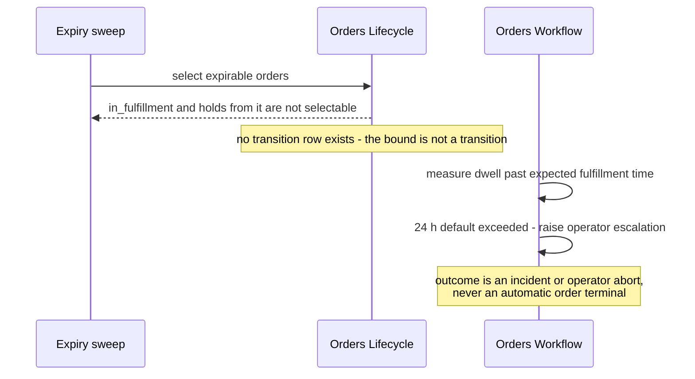

<!-- CONFLUENCE_TITLE: [BSS]: Orders Lifecycle — Hold, Resume and Bounded Lifetime (Slice 7) -->
<!-- Related: ../DESIGN.md, ../PRD.md, ./README.md, ./01-foundation.md | Owners: BSS Orders team -->

# DESIGN — Hold, Resume and Bounded Lifetime (Slice 7)

<!-- toc -->

- [1. Architecture Overview](#1-architecture-overview)
  - [1.1 Architectural Vision](#11-architectural-vision)
  - [1.2 Architecture Drivers](#12-architecture-drivers)
  - [1.3 Architecture Layers](#13-architecture-layers)
- [2. Principles and Constraints](#2-principles-and-constraints)
  - [2.1 Design Principles](#21-design-principles)
  - [2.2 Constraints](#22-constraints)
- [3. Technical Architecture](#3-technical-architecture)
  - [3.1 Domain Model](#31-domain-model)
  - [3.2 Component Model](#32-component-model)
  - [3.3 API Contracts](#33-api-contracts)
  - [3.4 Internal Dependencies](#34-internal-dependencies)
  - [3.5 External Dependencies](#35-external-dependencies)
  - [3.6 Interactions and Sequences](#36-interactions-and-sequences)
  - [3.7 Database Schemas and Tables](#37-database-schemas-and-tables)
  - [3.8 Deployment Topology](#38-deployment-topology)
- [4. Additional Context](#4-additional-context)
  - [4.1 Hold and resume (normative)](#41-hold-and-resume-normative)
  - [4.2 Bounded lifetime (normative)](#42-bounded-lifetime-normative)
  - [4.3 The `in_fulfillment` exemption (normative)](#43-the-in_fulfillment-exemption-normative)
  - [4.4 Draft abandonment (normative)](#44-draft-abandonment-normative)
  - [4.5 Policy values (open)](#45-policy-values-open)
  - [4.6 The ordinary cancel operation (normative)](#46-the-ordinary-cancel-operation-normative)
- [5. Traceability](#5-traceability)

<!-- /toc -->

- [ ] `p1` - **ID**: `cpt-cf-bss-orders-lifecycle-design-hold-and-expiry`

## 1. Architecture Overview

### 1.1 Architectural Vision

This slice owns time. It pauses an order and resumes it to exactly where it was, bounds every
in-flight state with a time-to-live, sweeps abandoned drafts, and — for the one state it must not
bound — hands off to an operational escalation owned elsewhere
([`../PRD.md`](../PRD.md) §6.3).

The reason bounded lifetime matters is commercial rather than hygienic. An order sitting
indefinitely in `submitted` pins a catalog price, holds an open promise to a customer, and
accumulates operational debt nobody is watching. So every in-flight state gets a configurable
TTL and expires to a terminal state with the system as actor.

Every state except one. `in_fulfillment` **must not** be auto-expired, because a subscription
spawn signal may already have been issued and expiring the order would orphan provisioned
resources with nothing to compensate them. The same exemption covers a hold taken *from*
`in_fulfillment`. This is the single place in the design where the bounded-lifetime rule is
deliberately broken, and the exemption lives in the transition table rather than in scheduler
logic — so a scheduler defect cannot expire such an order, and the bound becomes an operational
SLA raised by the sibling gear instead of an automatic transition.

Hold is narrower than it first appears, and the narrowness is the design. A hold changes **only
the order**. Already-activated subscriptions keep serving and keep billing, the term does not
extend, and wave-1 subscription drafts are not voided. Pausing a live subscription is a
subscription-lifecycle concern with its own posture; conflating the two would let an order-level
compliance hold silently stop a customer's billing.

### 1.2 Architecture Drivers

#### Functional Drivers

| Requirement | Design Response |
|-------------|------------------|
| `cpt-cf-bss-orders-lifecycle-fr-order-hold` | Hold stores the outgoing state on the aggregate; resume reads it as the target. Resume is a lookup, not an inference, so a state added later cannot break resume. |
| `cpt-cf-bss-orders-lifecycle-fr-order-expiry` | Expiry is an ordinary transition row with the system actor class. The `in_fulfillment` exemption and the hold-taken-from-`in_fulfillment` exemption are table rows that do not exist, not scheduler conditions. |
| `cpt-cf-bss-orders-lifecycle-fr-order-cancel` | Cancel from `on_hold` applies the **pre-hold** state's guards, so a hold cannot be used to widen what cancellation is permitted. |
| `cpt-cf-bss-orders-lifecycle-nfr-order-retention` | The abandoned-draft sweep auto-voids to `expired` rather than deleting, preserving the audit trail. |
| `cpt-cf-bss-orders-lifecycle-fr-order-events` | Expiry publishes `OrderExpired`; hold and resume publish `OrderHeld` and `OrderResumed`, which is how the sibling gear knows to suspend or resume its process. |

#### NFR Allocation

| NFR ID | NFR Summary | Allocated To | Design Response | Verification Approach |
|--------|-------------|--------------|-----------------|----------------------|
| `cpt-cf-bss-orders-lifecycle-nfr-order-audit-completeness` | 100 % of transitions audited | Expiry scheduler | An expiry is a normal transition, so it audits with `system` as actor class and the elapsed TTL as reason | Test asserting every expired order carries an audit row with the system actor |
| `cpt-cf-bss-orders-lifecycle-nfr-order-idempotency` | Zero duplicate effects | Expiry scheduler | The sweep runs under a singleton lease and each expiry uses a deterministic idempotency key derived from order and version, so a re-run is absorbed | Concurrency test running two sweep instances and asserting one expiry per order |
| `cpt-cf-bss-orders-lifecycle-nfr-order-retention` | Abandoned drafts auto-voided | Draft sweep | Auto-void is an ordinary transition to `expired`; there is no delete path | Test asserting an auto-voided draft and its audit trail remain readable |
| `cpt-cf-bss-orders-lifecycle-nfr-order-transition-latency` | Commit p95 < 1 s | Hold and resume | Both resolve no external input; resume reads one stored column | Load test on hold and resume |

#### Key ADRs

The seven gear ADRs govern this slice. One decision taken here is recorded in the register: **the pre-hold state is stored rather than
derived from the audit trail** ([`../DECISIONS.md`](../DECISIONS.md) D-80, §4.1), whose
alternative was reconstructing it from the last transition before the hold.

### 1.3 Architecture Layers

Inherited from [`01-foundation`](./01-foundation.md) §1.3. This slice adds two background
workers at the infrastructure layer, both singleton-coordinated.

## 2. Principles and Constraints

### 2.1 Design Principles

#### A hold changes only the order

- [ ] `p1` - **ID**: `cpt-cf-bss-orders-lifecycle-principle-hold-changes-only-order`

A hold pauses the order document and the sibling gear's process. It does not pause entitlement,
does not pause billing, does not extend a term, and does not void a subscription draft.
Already-activated subscriptions keep serving and keep billing throughout. An operator who needs
a customer's billing paused is asking for a subscription-lifecycle action, and this slice
deliberately cannot provide it.

#### The pre-hold state is stored, not derived

- [ ] `p1` - **ID**: `cpt-cf-bss-orders-lifecycle-principle-prehold-stored`

Hold writes the outgoing state to a column; resume reads it. The rejected alternative was
deriving it from the last transition before the hold, which would make resume depend on audit
interpretation and would break the moment an amendment or an administrative edit landed between
hold and resume.

#### Exemptions live in the table

- [ ] `p1` - **ID**: `cpt-cf-bss-orders-lifecycle-principle-exemptions-in-table`

`in_fulfillment` is not expirable because no such transition row exists — not because the
scheduler declines to select it. The distinction matters under defect: a scheduler bug can select
the wrong orders, and the transition table is the thing that refuses them anyway.

#### A park does not stop the clock

- [ ] `p1` - **ID**: `cpt-cf-bss-orders-lifecycle-principle-park-does-not-stop-clock`

When the sibling gear cannot obtain an approval-requirement verdict it parks fail-closed, leaving
the order in `submitted`. The `submitted` TTL **continues to elapse**, and expiry is the bound of
that park. An indefinitely parked order would be an unbounded open promise, which is exactly what
bounded lifetime exists to prevent.

### 2.2 Constraints

#### `in_fulfillment` has no automatic bound

- [ ] `p1` - **ID**: `cpt-cf-bss-orders-lifecycle-constraint-in-fulfillment-not-expirable`

Neither `in_fulfillment` nor a hold taken from it may be auto-expired, because a spawn signal
may already have been issued and expiry would orphan provisioned resources with no compensation.
Its bound is an **operational SLA** — a configurable window with a business default of 24 hours
past expected fulfillment time, with the fulfillment operator as named owner — raised by the
sibling gear. Exhausting the SLA **MUST NOT** produce a new order state; the outcome is an
incident or an operator abort.

#### Hold does not pause the Subscriptions draft TTL

- [ ] `p1` - **ID**: `cpt-cf-bss-orders-lifecycle-constraint-hold-does-not-pause-draft-ttl`

Wave-1 subscription drafts created during two-phase fulfillment are process artifacts of the
sibling gear. A hold does not void them and **must not be assumed** to pause the Subscriptions
draft auto-void TTL, which this gear neither owns nor can extend. Rebuilding a fulfillment plan
whose drafts expired under a hold is the sibling gear's concern, and this design must not imply
otherwise.

#### TTL values are unchosen

- [ ] `p1` - **ID**: `cpt-cf-bss-orders-lifecycle-constraint-ttl-values-unchosen`

The per-state TTL defaults, the draft auto-void TTL and the override scope —
platform versus seller — are all PRD open questions owned by Product. This slice specifies the
**policy model** and leaves the numbers as configuration with no code default, because a code
default would quietly become the answer.

## 3. Technical Architecture

### 3.1 Domain Model

- [ ] `p1` - **ID**: `cpt-cf-bss-orders-lifecycle-entity-hold-record`

The pause: the outgoing state stored as the resume target, the holding actor, the instant, and
the audited reason. It is a column set on the aggregate rather than a table, because at most one
hold is ever in force.

- [ ] `p1` - **ID**: `cpt-cf-bss-orders-lifecycle-entity-state-ttl-policy`

The per-state time-to-live configuration: the state it bounds, its duration, and its
configuration scope. Resolved at sweep time rather than stored per order, so a policy change
takes effect on orders already in flight.

**Relationships**:
- `Order root` → `Hold record`: zero-or-one; the pre-hold column is NULL unless the state is `on_hold`.
- `State TTL policy` → `Order root`: many-to-many by state, resolved at sweep time.
- `Hold record` → `State TTL policy`: an `on_hold` order is bounded by the `on_hold` TTL **unless** its pre-hold state is `in_fulfillment`, in which case it is unbounded and escalated instead.

### 3.2 Component Model

This slice realises `cpt-cf-bss-orders-lifecycle-component-hold-and-expiry`
([`../DESIGN.md`](../DESIGN.md) §3.2) as three internal parts.

#### Hold and resume handler

- [ ] `p1` - **ID**: `cpt-cf-bss-orders-lifecycle-component-hold-handler`

##### Why this component exists

Compliance holds, payment verification and operational pauses are needed at any active stage,
and the alternative to a pause is cancelling an order the seller intends to keep.

##### Responsibility scope

Hold admissibility from `submitted`, `pending_approval`, `approved` and `in_fulfillment`;
storage of the pre-hold state; resume to that stored state; and the cancel-from-`on_hold` path
that applies the pre-hold state's guards.

##### Responsibility boundaries

It pauses no subscription, no billing and no term, and voids no draft. It does not suspend the
sibling gear's timers — it publishes the event that lets that gear decide.

##### Related components (by ID)

- `cpt-cf-bss-orders-lifecycle-component-transition-orchestrator` — depends on

#### Expiry scheduler

- [ ] `p1` - **ID**: `cpt-cf-bss-orders-lifecycle-component-expiry-scheduler`

##### Why this component exists

Bounded lifetime is only real if something enforces it without a caller, and enforcing it twice
concurrently would double-expire orders.

##### Responsibility scope

The singleton-leased sweep; TTL policy resolution per state; selection of eligible orders;
deterministic idempotency keys per expiry; and the batch and cadence controls.

##### Responsibility boundaries

It holds no exemption logic — the transition table refuses `in_fulfillment` regardless of what
the sweep selects. It raises no escalation; that is the sibling gear's.

##### Related components (by ID)

- `cpt-cf-bss-orders-lifecycle-component-state-table` — depends on
- `cpt-cf-bss-orders-lifecycle-component-transition-orchestrator` — calls

#### Draft abandonment sweep

- [ ] `p2` - **ID**: `cpt-cf-bss-orders-lifecycle-component-draft-sweep`

##### Why this component exists

Abandoned baskets accumulate without bound, and deleting them would destroy the audit trail of
what a buyer nearly bought.

##### Responsibility scope

The lease-coordinated sweep over `draft` orders past their auto-void TTL, and the auto-void
transition to `expired` that keeps them readable.

##### Responsibility boundaries

It deletes nothing and touches no order past `draft`.

##### Related components (by ID)

- `cpt-cf-bss-orders-lifecycle-component-capture` — depends on

### 3.3 API Contracts

- [ ] `p1` - **ID**: `cpt-cf-bss-orders-lifecycle-interface-hold-ops`

- **Requirement**: `cpt-cf-bss-orders-lifecycle-interface-order-ops`
- **Technology**: REST/OpenAPI via `OperationBuilder`; RFC 9457 problems

| Method | Path | Description | Stability |
|--------|------|-------------|-----------|
| `POST` | `/bss-orders-lifecycle/v1/orders/{orderId}/cancel` | Cancel from any non-terminal state, per guards | unstable |
| `POST` | `/bss-orders-lifecycle/v1/orders/{orderId}/hold` | Pause from an eligible state, storing the outgoing state | unstable |
| `POST` | `/bss-orders-lifecycle/v1/orders/{orderId}/resume` | Return to the stored pre-hold state | unstable |

**State expiry is deliberately not a public operation.** It is scheduler-driven with the system
as actor class, which is what makes "who expired this order" answerable as `system` rather than
as whichever caller happened to trigger it.

**Reasons contributed to the registry**: already-on-hold, not-on-hold, resume-target-missing,
hold-cancel-refused-by-prehold-guard, **cancel-reason-required**,
**direct-cancel-window-closed** (shared with the seam slice, defined once here). The engine's own
`not-admissible` covers an inadmissible hold, resume, cancel or expiry alike, so this slice
registers no second name for any of it — the earlier `hold-not-admitted-in-state` and
`cancel-not-admitted-in-state` were exactly such second names and are deleted, matching the
treatment [`04-versioning`](./04-versioning.md) §3.3 records for the analogous amendment case
([`../DECISIONS.md`](../DECISIONS.md) D-38, `01 §3.3`).

### 3.4 Internal Dependencies

| Dependency Gear | Interface Used | Purpose |
|-------------------|----------------|----------|
| `toolkit-db` | Runtime-scoped access, via the engine | Hold columns and the sweep's selection queries |
| Coordination lease library | SDK client | Singleton coordination for the expiry sweep and the draft-abandonment sweep |

### 3.5 External Dependencies

None. Both sweeps are internal and neither reaches outside the gear. The `in_fulfillment`
escalation is raised by the sibling gear, which learns what it needs from the state events this
slice publishes.

### 3.6 Interactions and Sequences

#### Hold and resume

**ID**: `cpt-cf-bss-orders-lifecycle-seq-hold-resume`

**Use cases**: `cpt-cf-bss-orders-lifecycle-usecase-order-cancel-during-approval`

**Actors**: `cpt-cf-bss-orders-lifecycle-actor-orders-seller-operator`, `cpt-cf-bss-orders-lifecycle-actor-orders-workflow`

**Algorithm: Hold Then Resume**

Input: order_id, holding_actor, reason, security_context, idempotency_key
Output: on_hold then the restored state, or a registered refusal

1. [ ] - `p1` - Declare hold admissibility as an engine guard: the current state is `submitted`, `pending_approval`, `approved` or `in_fulfillment`; an inadmissible state refuses with the engine's `not-admissible` - `inst-hr-declare-admissibility-guard`
2. [ ] - `p1` - Supply the current state as the **pre-hold contribution** to the hold transition; the engine writes the column inside the transition transaction (`01 §3.6` *Attempt Transition* step 19.2) - `inst-hr-store-prehold`
3. [ ] - `p1` - Request the hold transition; the engine publishes OrderHeld - `inst-hr-request-hold`
4. [ ] - `p1` - **RETURN** on_hold - `inst-hr-return-on-hold`
5. [ ] - `p1` - **WHEN** resume is later requested: - `inst-hr-when-resume`
   1. [ ] - `p1` - **IF** the current state is not `on_hold`: **RETURN** not-on-hold refusal - `inst-hr-if-not-on-hold`
   2. [ ] - `p1` - **IF** no pre-hold state is stored: **RETURN** resume-target-missing refusal - `inst-hr-if-target-missing`
   3. [ ] - `p1` - Read the stored pre-hold state as the transition target - `inst-hr-read-prehold`
   4. [ ] - `p1` - Request the resume transition; the engine clears the pre-hold column and publishes OrderResumed (`01 §3.6` *Attempt Transition* step 19.3) - `inst-hr-request-resume`
   5. [ ] - `p1` - **RETURN** the restored state - `inst-hr-return-restored`

**Description**: Nothing about the spawned subscriptions changes at either end. A hold from
`in_fulfillment` leaves activated subscriptions serving and billing, and leaves wave-1 drafts
alone — including their own auto-void TTL, which this gear cannot pause.

#### The expiry sweep

**ID**: `cpt-cf-bss-orders-lifecycle-seq-expiry-sweep`

**Use cases**: `cpt-cf-bss-orders-lifecycle-usecase-order-new-acquisition`

**Actors**: `cpt-cf-bss-orders-lifecycle-actor-orders-seller-operator`, `cpt-cf-bss-orders-lifecycle-actor-orders-workflow`

**Algorithm: Sweep Expired Orders**

Input: current time
Output: expired count

1. [ ] - `p1` - Acquire the singleton sweep lease; **IF** not acquired, **RETURN** without work - `inst-es-acquire-lease`
2. [ ] - `p1` - **FOR EACH** expirable state — `submitted`, `pending_approval`, `approved`, `on_hold`: - `inst-es-for-each-state`
   1. [ ] - `p1` - Resolve the TTL policy for that state at its configuration scope - `inst-es-resolve-ttl`
   2. [ ] - `p1` - **IF** no TTL is configured: **SKIP TO** the next state (no code default) - `inst-es-if-no-ttl`
   3. [ ] - `p1` - **FOR EACH** seller scope with its own policy, and once for the platform fallback: select orders in that state whose `state_entered_at` is older than the TTL, up to the batch size, using the `(seller_tenant_id, state, state_entered_at)` index - `inst-es-select-eligible`
   4. [ ] - `p1` - **FOR EACH** selected order: - `inst-es-for-each-order`
      1. [ ] - `p1` - **IF** the state is `on_hold` **AND** its pre-hold state is `in_fulfillment`: - `inst-es-if-hold-from-fulfillment`
         1. [ ] - `p1` - **SKIP TO** the next order; this case is escalated, never expired - `inst-es-skip-exempt-hold`
      2. [ ] - `p1` - Derive a deterministic idempotency key from order and version - `inst-es-derive-key`
      3. [ ] - `p1` - Request the expiry transition with actor class `system` - `inst-es-request-expiry`
      4. [ ] - `p1` - **IF** the engine refuses as not-admissible: record and continue — the table is the authority - `inst-es-if-refused`
3. [ ] - `p1` - **RETURN** the expired count for the sweep metric - `inst-es-return-count`

**Description**: Step 2.4.4 is deliberate. The sweep's own exemption check at 2.4.1 is a
performance optimisation, not the safety mechanism — the safety mechanism is that no
`in_fulfillment` expiry row exists, so a sweep defect produces a refusal rather than an orphaned
order.

#### Overdue escalation handoff

**ID**: `cpt-cf-bss-orders-lifecycle-seq-overdue-handoff`

**Use cases**: `cpt-cf-bss-orders-lifecycle-usecase-order-fulfillment-complete`

**Actors**: `cpt-cf-bss-orders-lifecycle-actor-orders-workflow`, `cpt-cf-bss-orders-lifecycle-actor-orders-seller-operator`

**Description**: The handoff is by absence. This gear provides no expiry for the state and
publishes the events the sibling gear needs; that gear measures the window and raises the
escalation. Exhausting the SLA produces no new order state.

### 3.7 Database Schemas and Tables

This slice introduces one table and owns the `pre_hold_state` column on `orders_order`, both
relative to [`01-foundation`](./01-foundation.md) §3.7.

#### Table: orders_state_ttl_policy

**ID**: `cpt-cf-bss-orders-lifecycle-dbtable-state-ttl-policy`

**Schema**:

| Column | Type | Description |
|--------|------|-------------|
| policy_id | uuid | Policy identity |
| scope | enum | `platform` or `seller` |
| seller_tenant_id | uuid, nullable | NULL for a platform-scope policy |
| state | enum | The bounded state: `submitted`, `pending_approval`, `approved`, `on_hold`, or `draft` for the auto-void sweep |
| ttl | interval | The bound |
| updated_by, updated_at | text, timestamptz | Audit of the policy change itself |

**PK**: policy_id

**Constraints**: `(scope, seller_tenant_id, state)` UNIQUE **with `NULLS NOT DISTINCT`**, because
`seller_tenant_id` is NULL for platform scope and SQL otherwise treats those NULLs as distinct,
permitting duplicate platform policies ([`../DECISIONS.md`](../DECISIONS.md) D-28);
`seller_tenant_id` NOT NULL exactly when `scope` is `seller`; `state` **MUST NOT** be
`in_fulfillment` — the exemption is a schema constraint as well as a missing transition row, so a
policy cannot be authored for it.

**Additional info**: seller scope overrides platform scope for the same state. There is **no code
default** for any TTL; an unconfigured state is not swept, so the absence of a policy is visible
as orders that never expire rather than as a silently applied constant.

The **dwell time** an expiry is measured against is `orders_order.state_entered_at`, maintained by
the engine inside the transition that changes state — not derived from the audit trail, which
would be an N+1 correlated subquery over the largest table in the gear on every sweep, and which
would also contradict the rule that no read derives order state from the audit store. A resumed
order restarts its bound because resume sets the column. The same column serves the "in this state
since" list filter, so the two slices no longer specify opposite sources for one fact
([`../DECISIONS.md`](../DECISIONS.md) D-22).

### 3.8 Deployment Topology

Inherited from [`01-foundation`](./01-foundation.md) §3.8, with two of the gear's four
lease-coordinated workers owned here: the **expiry sweep** and the **draft auto-void sweep**. Both
take a lease, so a multi-replica deployment cannot double-expire. Both are idle-cheap: a sweep
with no configured TTL does no work at all.

**Observability owned here**: expiry counts per state per sweep, sweep duration and batch
saturation, the count of orders **skipped as exempt** (which should be non-zero only for holds
taken from `in_fulfillment`), the number of states with **no configured TTL** — the signal that a
Product-owned value is still unset and orders are silently immortal — cancel counts by actor class
and reason, and hold duration distribution. Alerts fire on a sweep failing to acquire its lease
for longer than two cadences, on batch saturation persisting (the sweep is falling behind), and on
any state having no configured TTL in a production environment.

## 4. Additional Context

### 4.1 Hold and resume (normative)

Hold **MUST** be admitted from `submitted`, `pending_approval`, `approved` and `in_fulfillment`,
and the outgoing state **MUST** be stored as the resume target rather than derived. Resume
**MUST** return the order to exactly that state and clear the stored value. Both **MUST** be
idempotent and audited, and both publish their event so the sibling gear can suspend and resume
its process.

Cancel from `on_hold` **MUST** apply the **pre-hold state's** cancel guards. In particular a
hold taken from `in_fulfillment` after a spawn signal does **not** re-open the direct-cancel
window: the guard reads the recorded spawn signal, and a hold does not clear it.

A hold **MUST NOT**: pause entitlement or billing on any activated subscription, extend a term,
void a wave-1 subscription draft, or be assumed to pause the Subscriptions draft auto-void TTL.
Already-activated subscriptions keep serving and keep billing for the duration of the hold.

### 4.2 Bounded lifetime (normative)

Every in-flight state **MUST** have a bounded lifetime, delivered as a configurable TTL per
state for `submitted`, `pending_approval`, `approved` and `on_hold`. On elapse the order **MUST**
transition to `expired`, publish `OrderExpired`, and audit with actor class `system`.

Expiry **MUST** be scheduler-driven and **MUST NOT** be a public operation. Its idempotency key
**MUST** be deterministic from order and version so a re-run is absorbed rather than duplicated.

A **fail-closed park does not suspend the clock**: where the sibling gear cannot obtain an
approval-requirement verdict, the order remains `submitted` and the `submitted` TTL continues to
elapse. Expiry is the bound of that park, and the sibling gear is required to escalate before it
fires.

### 4.3 The `in_fulfillment` exemption (normative)

`in_fulfillment` **MUST NOT** be auto-expired, and neither **MUST** an `on_hold` order whose
pre-hold state is `in_fulfillment`. This is an explicit exemption from §4.2, taken because a
subscription spawn signal may already have been issued and expiry would orphan provisioned
resources with no compensation path.

The exemption **MUST** be structural: no such transition row exists, and no TTL policy may be
authored for the state. A sweep that selects such an order **MUST** receive a not-admissible
refusal rather than succeeding.

The bound for these cases is an **operational SLA** raised by the sibling gear: a configurable
window with a business default of **24 hours past expected fulfillment time**, where expected
fulfillment time is `max(now, latest service-activation date among the order's lines)` at
begin-fulfillment. A legitimately future-dated line therefore does not start the clock until its
date. The named owner is the fulfillment operator. **Exhausting the SLA MUST NOT auto-terminal
the order**: the outcome is an incident or an operator abort, not a new order state. The same
window bounds a stalled operational compensation.

### 4.4 Draft abandonment (normative)

A `draft` not submitted within its configurable auto-void TTL **MUST** transition
`draft → expired` with actor class `system`, publishing `OrderExpired`. It is **auto-voided**, and
that is the only term used for the outcome across the set — "archived" is not a state and there is
no `archived` state in the machine. Auto-void deletes nothing: the order and its trail remain
readable in the terminal state, so what a buyer nearly bought survives
([`../DECISIONS.md`](../DECISIONS.md) D-14). The sweep **MUST**
be singleton-coordinated and **MUST NOT** touch any order past `draft`.

Dwell is measured from the order's creation instant for this sweep specifically, since a `draft`
has had no state transition since creation.

### 4.5 Policy values (open)

Two groups, distinguished because they have different owners. **PRD open questions owned by
Product**, each cited by its §15 row:

| Value | PRD §15 row | Note |
|-------|-------------|------|
| `submitted` TTL | row 7 | Must exceed the sibling gear's escalation lead time, since expiry bounds the fail-closed park |
| `pending_approval` TTL | row 7 | Should relate to the sibling gear's 72-hour default approval escalation window |
| `approved` TTL | row 7 | The only exit for a declined payment instrument, per [`05-preconditions`](./05-preconditions.md) §4.4 |
| `on_hold` TTL | row 7 | The PRD names this the worst case, being deliberately open-ended in intent |
| Override scope | row 7 | Whether seller scope may override platform scope per state |
| `draft` auto-void TTL | row 5 | Bounds unbounded basket accumulation; the same row carries the program retention period, tracked as [`../DECISIONS.md`](../DECISIONS.md) Q-07 |

Rows 5 and 7 are the two §15 questions this slice waits on. Nothing else here is open: the
idempotency-key window is **24 hours**, settled in [`01-foundation`](./01-foundation.md) §4.2
([`../DECISIONS.md`](../DECISIONS.md) D-39), and is not a policy value of this slice.

**Design-owned values**, set here as working baselines rather than left blank:

| Value | Baseline | Note |
|-------|----------|------|
| Sweep cadence | every 5 minutes per worker | Bounds expiry latency to one cadence past the TTL |
| Sweep batch size | 500 orders | Keeps a sweep transaction short enough not to hold the aggregate locks it takes |
| Overdue window | **24 hours** past expected fulfillment time | **Not** an open question: the PRD commits this as a business default; it is recorded here as committed rather than as unchosen |

Leaving the Product-owned values unset means an unconfigured state is **not swept**. That failure
mode is visible — orders that never expire — which is preferable to a code default silently
becoming the platform answer.

### 4.6 The ordinary cancel operation (normative)

This slice owns `POST /cancel`, because it already owns the cancel-from-`on_hold` guard and the
bounded-lifetime machinery cancellation sits alongside. It previously belonged to no slice: three
transition rows and three actor permissions depended on an operation with no algorithm, no guards
and no registered reasons ([`../DECISIONS.md`](../DECISIONS.md) D-36).

**Algorithm: Cancel Order**

Input: order_id, cancelling_actor, reason, security_context, idempotency_key, expected_version
Output: cancelled, or a registered refusal

1. [ ] - `p1` - Declare the guards the engine evaluates: non-terminal state, a **mandatory** cancel reason, and the pre-hold guard where the state is `on_hold` - `inst-co-declare-guards`
2. [ ] - `p1` - **IF** the current state is `in_fulfillment`: defer to the spawn-signal guard owned by [`06-workflow-seam`](./06-workflow-seam.md) §3.6 *Evaluate Cancel From In-Fulfillment* (with §4.3 for the write-once spawn-signal rule) - `inst-co-defer-spawn-guard`
3. [ ] - `p1` - Request the cancel transition; the engine records the actor and the reason on the audit entry and publishes `OrderCancelled` - `inst-co-request-transition`
4. [ ] - `p1` - **RETURN** cancelled - `inst-co-return-cancelled`

A cancel reason is **mandatory** for every actor, not only the seller operator, because the audit
value of a cancellation is the reason. After `completed` there is no cancellation window at all:
post-purchase rights are exercised on the spawned subscriptions, and the money reverse is a
Billing credit note.

## 5. Traceability

- **PRD**: [`../PRD.md`](../PRD.md) — §6.3 cancellation, hold and state expiry
- **Gear design**: [`../DESIGN.md`](../DESIGN.md) — realises `cpt-cf-bss-orders-lifecycle-component-hold-and-expiry`
- **Engine**: [`01-foundation`](./01-foundation.md) — the hold and expiry transition rows, the pre-hold column, the missing `in_fulfillment` expiry row
- **Depends on**: [`02-capture`](./02-capture.md) for the draft creation instant; [`06-workflow-seam`](./06-workflow-seam.md) for the spawn signal the hold-cancel guard reads
- **Consumers**: [`05-preconditions`](./05-preconditions.md) relies on the `approved` TTL as a declined instrument's only exit
- **Sibling gear**: raises the overdue escalation and suspends its process on `OrderHeld`
- **ADRs**: [`ADR/0001`](../ADR/0001-cpt-cf-bss-orders-lifecycle-adr-transition-through-engine.md) transition through the engine; [`ADR/0002`](../ADR/0002-cpt-cf-bss-orders-lifecycle-adr-slice-decomposition.md) the foundation-plus-seven-slices decomposition; [`ADR/0004`](../ADR/0004-cpt-cf-bss-orders-lifecycle-adr-closed-enumerations.md) the closed state and event enumerations